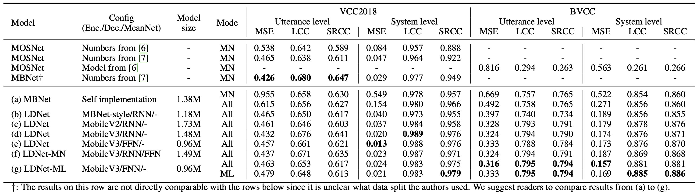
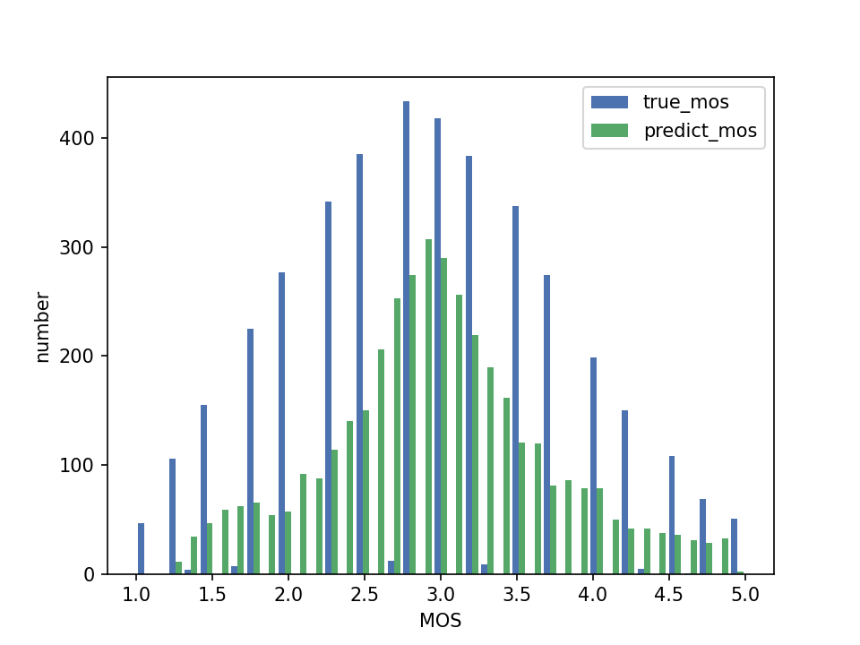
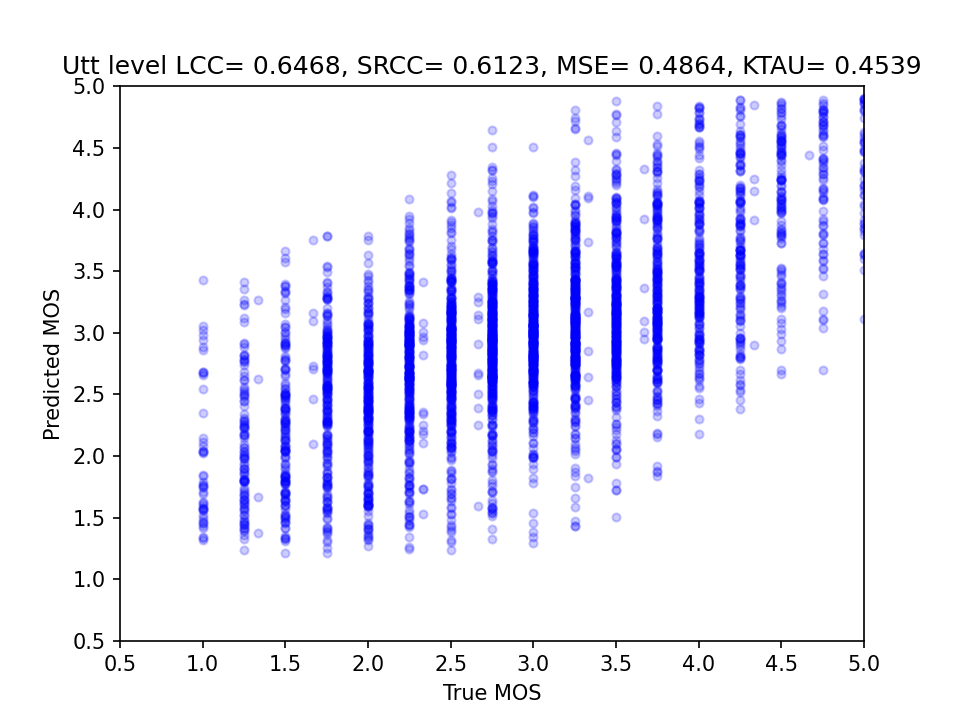
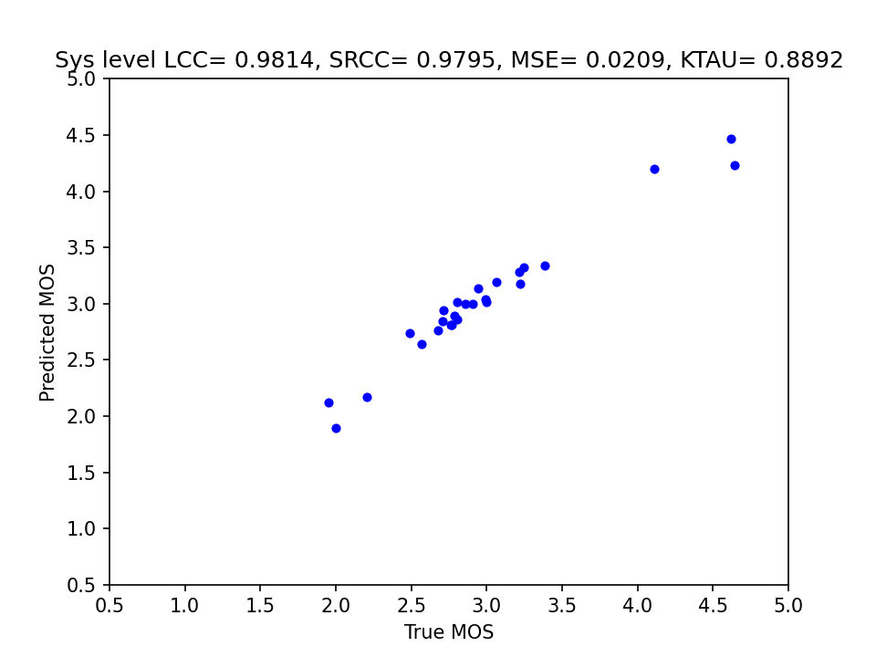

# LDNet

Author: Wen-Chin Huang (Nagoya University)
Email: wen.chinhuang@g.sp.m.is.nagoya-u.ac.jp

This is the official implementation of the paper "LDNet: Unified Listener Dependent Modeling in MOS Prediction for Synthetic Speech". This is a model that takes an input synthetic speech sample and outputs the simulated human rating.



## Usage

Currently we support only the VCC2018 dataset. We plan to release the BVCC dataset in the near future.

### Requirements

- PyTorch 1.9 (versions not too old should be fine.)
- librosa
- pandas
- h5py
- scipy
- matplotlib
- tqdm

### Data preparation

```
# Download the VCC2018 dataset.
cd data
./download.sh vcc2018
```

### Training

We provide configs that correspond to the following rows in the above figure:

- (a): `MBNet.yaml`
- (d): `LDNet_MobileNetV3_RNN_5e-3.yaml`
- (e): `LDNet_MobileNetV3_FFN_1e-3.yaml`
- (f): `LDNet-MN_MobileNetV3_RNN_FFN_1e-3_lamb4.yaml`
- (g): `LDNet-ML_MobileNetV3_FFN_1e-3.yaml`

```
python train.py --config configs/<config_name> --tag <tag_name>
```

By default, the experimental results will be stored in `exp/<tag_name>`, including:

- `model-<steps>.pt`: model checkpoints.
- `config.yml`: the config file.
- `idtable.pkl`: the dictionary that maps listener to ID.
- `training_<inference_mode>`: the validation results generated along the training. This file is useful for model selection. Note that the `inference_mode` in the config file decides what mode is used during validation in the training.

There are some arguments that can be changed:

- `--exp_dir`: The directory for storing the experimental results.
- `--data_dir`: The data directory. Default is `data/vcc2018`.
- `seed`: random seed.
- `update_freq`: *This is very important. See below.* 

### Batch size and `update_freq`

By default, all LDNet models are trained with a batch size of 60. In my experiments, I used a single NVIDIA GeForce RTX 3090 with 24GB mdemory for training. I cannot fit the whole model in the GPU, so I accumulate gradients for `update_freq` forward passes and do one backward update. Before training, please check the `train_batch_size` in the config file, and set `update_freq` properly. For instance, in `configs/LDNet_MobileNetV3_FFN_1e-3.yaml` the `train_batch_size` is 20, so `update_freq` should be set to 3.

### Inference

```
python inference.py --tag LDNet-ML_MobileNetV3_FFN_1e-3 --mode mean_listener
```

Use `mode` to specify which inference mode to use. Choices are: `mean_net`, `all_listeners` and `mean_listener`. By default, all checkpoints in the exp directory will be evaluated.

There are some arguments that can be changed:

- `ep`: if you want to evaluate one model checkpoint, say, `model-10000.pt`, then simply pass `--ep 10000`.
- `start_ep`: if you want to evaluate model checkpoints after a certain steps, say, 10000 steps later, then simply pass `--start_ep 10000`.

There are some files you can inspect after the evaluation:

- `<dataset_name>_<inference_mode>.csv`: the validation and test set results.
- `<dataset_name>_<inference_mode>_<test/valid>/`: figures that visualize the prediction distributions, including;
    - `<ep>_distribution.png`: distribution over the score range (1-5).  
        
    - `<ep>_utt_scatter_plot_utt`: _utterance-wise_ scatter plot of the ground truth and the predicted scores.  
        
    - `<ep>_sys_scatter_plot_utt`: _system-wise_ scatter plot of the ground truth and the predicted scores.  
        

## Acknowledgement

This repository inherits from this great [unofficial MBNet implementation](https://github.com/sky1456723/Pytorch-MBNet).
